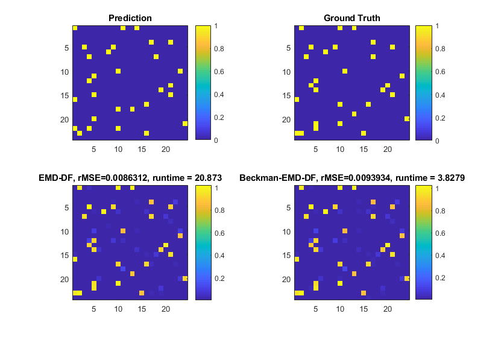

# Earth Mover's Distance Dynamic Filtering

MATLAB implementation of the EMD-DF algorithm ([paper](https://arxiv.org/abs/1806.04674)).

## Paper abstract
Sparse signal models have enjoyed great success, achieving state-of-the-art performance in many applications.
Some algorithms further improve performance by taking advantage of temporal dynamics for streaming observations.
However, the tracking regularizers are often based on the $\ell_p$-norm which does not take full advantage of the relationship between neighboring signal elements.
In this work, we propose the use of the earth mover's distance (EMD) as an alternative tracking regularizer for causal tracking when there is a natural geometry to the coefficient space that should be respected (e.g., meaningful ordering).
Our proposed earth mover's distance dynamic filtering (EMD-DF) algorithm is a causal approach to tracking time-varying sparse signals that includes two variants: one which uses the traditional EMD as a tracking regularizer for sparse nonnegative signals, and a relaxation which allows for complex-valued signals.
In addition, we present a computationally efficient formulation of EMD-DF (based on optimal transport theory), improving computational scalability for large state vectors.
Through a series of simulations, we demonstrate the advantages of EMD-DF compared to existing methods on tracking sparse targets in state vectors with multiple dimensions and tracking sparse frequencies in time-series estimation.
In the context of frequency tracking, we illustrate the advantages of EMD-DF in tracking neural oscillations in electrophysiology recordings from rodent brains.
 We demonstrate that EMD-DF causally produces representations that achieve much higher time-frequency resolution than traditional causal linear methods such as the Short-Time Fourier Transform (STFT).

## Requirements
- [MATLAB](https://www.mathworks.com/products/matlab.html)
- [CVX](http://cvxr.com/cvx/)

## Getting started
- Download and install the [CVX](http://cvxr.com/cvx/) optimization package for MATLAB
- Clone the code in this repository:
`git clone  https://github.com/siplab-gt/emd-df.git`
- Run `demo.m` in MATLAB which should produce the following:

